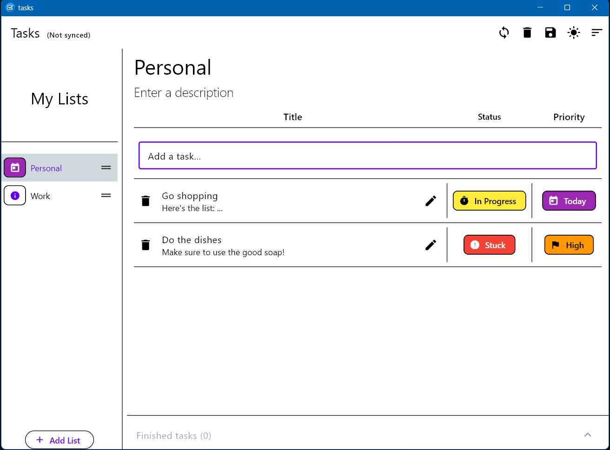
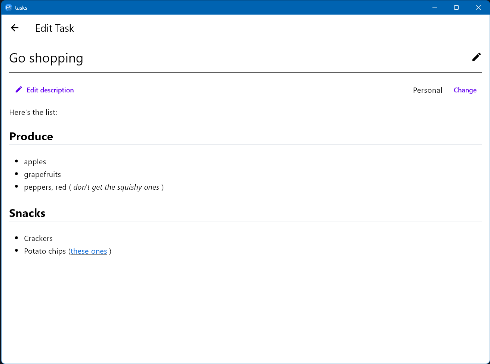

# Tasks App

A native, cross-platform, privacy-first Tasks App with peer-to-peer synchronization

Supports Windows and Android. but support for other platforms can easily be added.

## Motivation

For a while now, I've wanted an app that: 

- has multiple lists, maybe even nested lists
- features a compact list view to maximize tasks on-screen
- has a few columns or fields per task that I care about, namely priority and status, but with room for more
- shows at-a-glance information about which tasks have high priority across all lists
- does not send my data to any third party servers, but instead uses local storage on my devices
- can sync with my other devices peer-to-peer, without routing my data through the cloud
- supports exporting and importing tasks in a standard format like JSON
- …and lots more

Many ToDo apps and tasks app exist on all sorts of app stores. This is a project I'm building for myself, so it is very opinionated, but also gives me the option to add features at any time. 

## Screenshots

| The main tasks page                          | Task descriptions support full markdown     |
| -------------------------------------------- | ------------------------------------------- |
|  |  |

## Implementation

### Client-based architecture

All tasks, lists, and settings are saved locally on the device. The application supports exporting all data to JSON files in a folder of your choice for easy sharing or scripting. The client itself runs Flutter, allowing for smooth animations, pleasant light and dark modes, and cross-platform functionality. 

### Optional server or peer-to-peer synchronization

The tasks app runs a server in the background that can receive tasks from another client and respond with its own tasks. The client and server compare versions and task UUIDs to gracefully merge updates, allowing you to confidently track your tasks on any device and sync them at any time. 

When you press refresh, the server uses mDNS to find a device on your local network that is also running the tasks app. If it finds one, it connects to its IP address and port and initiates a sync. This allows you to sync between your phone and laptop while on the go, even on public Wi-Fi (while mDNS is not secure, the actual data transfer is done over HTTPS).

To support a home environment where all devices can sync from a source of truth, there is a standalone version of the server to self-host on, say, a Raspberry Pi. to accept sync requests from any device. If a client detects that a dedicated server is on the network, it will prioritize syncing with that over other clients. This helps multiple clients sync up faster and more efficiently, without requiring many peer-to-peer synchronizations on each update. 

This flexibility allows you to stay in charge of your data while offering convenience that doesn't require a public server for you to send your data to. 

## Wishlist

More low-priority features are planned for this app, such as:

- A REST API to get tasks based on criteria
- An overview page to summarize recent productivity and surface important tasks from various lists
- Checklist tasks (already supported now with markdown, but specialized buttons would help)
- Task size estimates, task duration (ie, time tracking)
- Export to markdown, import from markdown to support quick note-taking